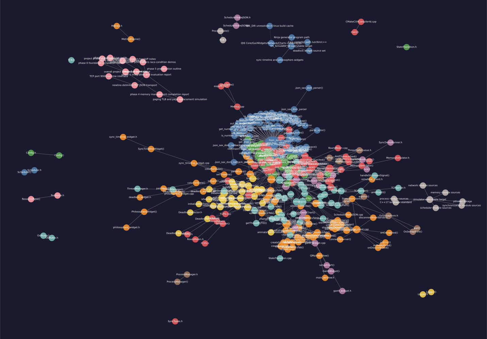

# OS Process Scheduler Simulator

A C++/Qt6 operating-systems simulator with live scheduling and synchronization visualization.

## Current Status

- Phase 0 complete: environment, PCB/TCB, state transitions, config, logger.
- Phase 1 complete: FCFS/RoundRobin/Priority schedulers, metrics engine, TCP JSON stream, Qt Gantt/metrics UI.
- Phase 2 complete: synchronization demos (mutex, semaphore, producer-consumer, philosophers, race condition) + synchronization UI tab.
- Phase 4 complete: virtual memory management with paging, TLB, FIFO/LRU/Optimal page replacement, memory metrics UI tab.
- Phase 5 complete: integrated simulator and evaluation artifacts for the final demo.

## Graph Visualization on GitHub

GitHub does not execute interactive HTML in repository view, so opening `graphify-out/graph.html` in the repo often shows source text instead of an interactive diagram.

Live interactive graph (GitHub Pages):

- https://m-saad-bin-mazhar.github.io/OS_Kernel/
- https://m-saad-bin-mazhar.github.io/OS_Kernel/graph.html
- Fallback preview (works even before Pages finishes provisioning):
  https://htmlpreview.github.io/?https://raw.githubusercontent.com/M-SAAD-BIN-MAZHAR/OS_Kernel/main/graphify-out/graph.html

Use the static SVG below for GitHub preview:



Graph artifacts:

- Static diagram (GitHub-friendly): `graphify-out/graph.svg`
- Interactive graph (open locally in browser): `graphify-out/graph.html`
- Graph data: `graphify-out/graph.json`
- Audit report: `graphify-out/GRAPH_REPORT.md`

## Architecture

- Engine: `OS_Kernel` (C++17, TCP server on port `9000`)
- UI: `OS_Simulator_Qt` (Qt6 Widgets + Charts, TCP client)
- Transport: newline-delimited JSON messages over TCP

## Features

- Process + thread management:
  - PCB + TCB models
  - 5-state lifecycle transitions
- CPU scheduling:
  - FCFS
  - Round Robin (quantum)
  - Priority
- Metrics:
  - Wait time
  - Turnaround time
  - CPU utilization
  - Throughput
- Synchronization demos:
  - OsMutex (lock/unlock/tryLock with event logging)
  - OsSemaphore (wait/signal)
  - Producer-Consumer
  - Dining Philosophers (deadlock + safe)
  - Race condition (with/without mutex)
- Memory management:
  - Virtual paging with configurable page size
  - TLB (Translation Lookaside Buffer) with LRU replacement
  - Three page replacement algorithms: FIFO, LRU, Optimal
  - Real-time metrics: page fault rate, TLB hit rate, memory utilization
  - Address translation (logical → physical)
  - Frame and page table visualization
- Networking:
  - TCP server on port 9000
  - Newline-delimited JSON stream for scheduler and sync state

## Repository Layout

- `OS_Kernel/src/process`: PCB/TCB, ProcessManager, ThreadManager, state transitions
- `OS_Kernel/src/scheduler`: FCFS, RoundRobin, Priority, metrics
- `OS_Kernel/src/network`: TCP server + scheduler JSON serialization
- `OS_Kernel/src/sync`: OsMutex, OsSemaphore, synchronization demo runner
- `OS_Simulator_Qt/src`: main window, socket client, gantt widget, sync timeline, philosophers widget

## Build

### Engine (WSL/Linux)

```bash
cd /home/msaad/OS_Simulator1/OS_Kernel
mkdir -p build
cd build
cmake -G Ninja ..
ninja
```

### Qt UI (Windows with Qt 6.x)

Use Qt Creator with a Desktop Qt6 MinGW kit, open:

- `C:\Users\msaad\OS_Simulator_Qt\CMakeLists.txt`

If you also open the project from WSL paths, use a separate build directory per source root.

## Run (Windows UI + WSL Engine)

1. Start engine in WSL:

```bash
cd /home/msaad/OS_Simulator1
./build/simulator
```

2. Start UI from Qt Creator on Windows.
3. UI connects to `localhost:9000`.

Notes:

- Engine stays alive until interrupted (`Ctrl+C`).
- UI includes a Windows-safe rendering mode to reduce animation-related instability.

## Runtime Commands (from UI)

- `{"command":"select_scheduler","algorithm":"FCFS|RoundRobin|Priority"}`
- `{"command":"start_simulation"}`
- `{"command":"start_sync_demo","demo":"producer_consumer|philosophers_deadlock|philosophers_safe|race"}`

## JSON Stream Types

- Scheduler frame (no `type` field): contains `ganttChart`, `processes`, `metrics`
- Sync frame (`"type":"sync"`): contains `events`, `timeline`, `philosophers`, `race`

## Troubleshooting

### 1) CMake source mismatch

Symptom: cache/source path mismatch errors in Qt Creator.

Fix:

- Delete old Qt build directory (`Desktop_Qt_*_Debug`) or reset CMake cache.
- Reconfigure using one source root consistently (Windows path or WSL path).

### 2) UI says connected then disconnects

Typical causes:

- Engine not running from latest binary.
- Engine was interrupted.

Fix:

- Rebuild engine and run `./build/simulator` from `/home/msaad/OS_Simulator1`.

### 3) `setGeometry` warnings on Windows

Cause: window minimum size constraints larger than monitor work area.

Fix in current codebase:

- Reduced minimum heights for sync widgets and event list.
- Set practical main window minimum size.

### 4) Windows UI + WSL engine networking

`localhost` generally works via WSL forwarding. If needed, switch UI host to WSL IP in `SimulatorClient` creation.

## Quick Functional Check

With engine running and UI connected:

- Scheduler tab: click Start Simulation and observe Gantt + metrics updates.
- Synchronization tab: run `Race Condition`; expect:
  - `withoutMutex` not reliably equal to `100000`
  - `withMutex` equals `100000`

## License

For educational use in OS simulation coursework.
